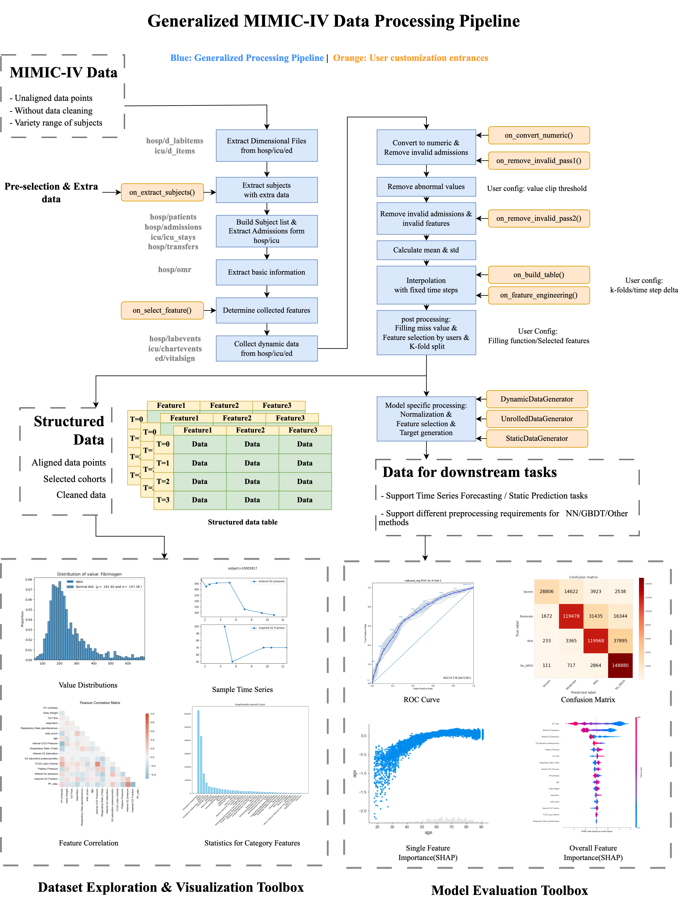

# MIMIC-IV Data Processing Pipeline

**[中文版本](README_CN.md) | [English Version](README.md)**

The MIMIC-IV dataset is widely used in various medical researches, however, the original dataset has not undergone data cleaning. This framework provides a highly configurable Pipeline for MIMIC-IV, aiming at minimal encapsulation, high flexibility, and easy extensibility. The code for data processing is low coupled and can be easily merged with the processing code for other datasets. The framework itself provides a default processing flow, and at the same time, the framework provides user-defined configurations at both the configuration file and calling interface levels, which can meet complex user-defined requirements.

## Architecture

The framework consists of three main parts: dataset dataset, model model, and analyzer analyzer. dataset abstracts the original data into torch.dataset interface; model computes outputs on batch inputs; and analyzer is similar to trainer, providing K-fold, metrics computation, plotting, and other tasks. Splitting model and analyzer makes it more convenient for a single analyzer to call multiple models for integrated learning, and for a single model to be called by multiple analzyers. The rest of the tools section includes common tools and methods, and the configs section is for fields that need to be configured, such as paths, parameters for data cleansing, and so on.

analyzer: the analyzer module
1. analyser: runs the analyser in a sequence and needs to be registered when adding a new analyser.
2. container: store parameters that are not related to the model
3. feature_explore: generates an exploratory report of the dataset, with configurable generation parameters
3. utils: utility methods

configs: Configuration files for each dataset.
1. global_config: configuration path
2. mimiciv_dataset: corresponds to `dataset/mimic_dataset.py`, by default it is configured for extracting patients with oxygenation indices and corresponding features from Sepsis patients, it is recommended to modify the downstream tasks on this dataset.
3. mimiciv_dataset_raw: corresponds to `dataset/mimic_raw_dataset.py`, provides a minimally processed dataset for data probing

other modules:
- data: dataset file
- datasets: dataset abstractions, including data extraction/cleaning/reorganisation
- libs: third-party libraries and related code
- models: models
- outputs: output folder
- tools: tool classes
- main.py: main entry, interfaces with the launcher via parameters

## Deployment method

Follow the steps below to deploy:
1. Configure the conda environment under `python=3.10.11` and install the required packages: `pip install -r requirements.txt`.
2. In the first step, refer to the next subsection for the cuda version of pytorch.
3. Extract the MIMIC-IV dataset to the `data/mimic-iv` folder, with sub-folders `hosp`, `icu`, etc.
4. (Optional) If there is a MIMIC-IV-ED file, extract it to the `ed` subfolder.
5. store the generated `sepsis3.csv` under `data/mimic-iv/sepsis_result`.
6. Run `python -u main.py` to generate it all at once.

Install the corresponding CUDA version of Pytorch:
1. Create and enter a new conda virtual environment.
2. Type `nvidia-smi` to see which CUDA version is installed on the server.
3. Follow the installation command at https://pytorch.org/get-started/previous-versions/ to select the corresponding version under linux, the CUDA version of pytorch can be behind the CUDA version of the server.
4. Check if the installation was successful: https://blog.csdn.net/qq_45032341/article/details/105196680
5. If you installed a different version of pytorch than the one in `requirements.txt`, delete the corresponding line to avoid duplicate installations.
6. The framework itself has no strict restrictions on the versions of third-party libraries.

## MIMIC-IV datasets

We divide the processing of the dataset into two parts: `dataset specific processing`, which deals with issues arising from the internal structure of the dataset, and `model & task specific processing`, which does different processing for different downstream tasks. The code in `datasets/mimiciv/MIMICIV` is used for `dataset specific processing`, and in general the user does not need to modify its contents.

`model & task specific processing` is done by derived classes and `data_generator`. `datasets/mimic_dataset/MIMICIVDataset` is a derived class of `MIMICIV`, which enables flexible processing of different downstream tasks by overriding abstract methods starting with `on_`, and the user needs to modify this code for different research needs. Each derived class of `MIMICIV` has a separate configuration file in `config`, which can be modified to adjust the behaviour of `MIMICIV` without modifying the code.

### Introduction to the MIMICIV processing flow

This part of the processing corresponds to `dataset specific processing`, in most cases users do not need to modify the contents of it, but only need to understand the general processing flow and the definition of the interface. According to the principle of minimal encapsulation, only `@property` is used to distinguish between internal and external visible properties, and `@abstractmethod` is used to indicate which methods need to be overridden by derived classes.

**Data access**: `MIMICIV`'s data processing is divided into 7 stages (phases), and the processed data from each stage is stored in cache under `data/mimic-iv-XXX/cache` (e.g. `data/mimic-iv-raw/cache` in the case of `mimic_raw`), once Once all the data is processed, only the cache corresponding to the final result is loaded each time it is instantiated, removing unnecessary IO operations, at which point `Bare Mode Enabled` is displayed. In addition, in order to save space, the cache is compressed using the lzma algorithm, the compression time will be greater than that of the pickle direct storage, but it has almost no effect on reading, if you need to save the compression time, modify `configs/mimic_dataset/compress_cache` to `False

**preprocess_phase1**: load `hosp`, `icu` item mapping tables, create corresponding mapping tables for `ed`, no need to actually read ED data. Afterwards call `on_extract_subjects` to introduce the list of subjects and external data to be filtered.

**preprocess_phase2**: read the basic information of the patient according to the subject_id list, this phase calls `on_build_subject`, `on_extract_admission` successively.

**preprocess_phase3**: Traverses all available data from MIMIC-IV and extracts the required data. There are three data sources (`icu`, `ed`, `hosp`) via `configs/mimic_dataset/data_linkage` it is possible to configure which data sources do not need to be read. Simply exclude which features are not needed before data extraction via `on_select_feature`

**preprocess_phase4**: Converts the data to numeric, filters the available samples, and finally constrains the outliers to be within the normal range according to `configs/mimic_dataset/value_clip`. In the first two processes, `on_convert_numeric`, `on_select_admissions` will be called in turn.

**preprocess_phase5**: further removes features and samples with high missing rates, generating per-feature statistics that are generated before the timeline alignment and are therefore unaffected by interpolation and missing padding. This step will call `on_remove_missing_data`

**preprocess_phase6**: Interpolation and alignment of unevenly sampled data, generation of a 3D array `(n_subject, n_feature, n_sequence)` at regular intervals, with different lengths of sequences filling in the end with `-1`, and finally feature engineering. This stage calls `on_build_table`, `on_feature_engineering` in turn

Interpolation considers three cases:
1. the head and tail of an admittance are determined by `configs/mimic_dataset/align_target`, looking for the earliest and latest points in time at which the target features are both present. The interpolation interval is determined by `configs/mimic_dataset/delta_t_hour`.
2. when historical data exists at a given point in time, the most recent historical available data is used, regardless of causality
3. when the interpolation start time is earlier than the known historical data for that feature, the first data point is used to fill in the gaps.

**preprocess_phase7**: Generate different derived versions of the same dataset according to `configs/mimic_dataset/version`, user can customise the restriction and exclusion ranges of features in the configuration, specify the handling of missing values, currently supports `avg` mean fill and `none` default (- 1) padding. Different versions can be used for data exploration and model training respectively.

### Introduction to MIMICIV derived dataset

This section corresponds to the functions in `datasets/mimic_dataset`, and it is recommended that the user modifies only the necessary parts and specifies the input and output formats of the interface. This framework has few checks for user-defined behaviour, which may cause the rest of the Pipeline to report errors if user-modified parts introduce new problems (e.g., generating NaNs).

**on_extract_subjects**

Output: dict[key=int(subject_id), value=object(extra_data)]
1. subject_id needs to cover all patients captured, and can be linked to other data pipelines, e.g. by reading the derivation table of `mimic-code`.
2. `extra_data` contains additional data corresponding to the subject, in an unrestricted format, and is only processed by the user in `on_build_subject

**on_build_subject**

Creating an instance of Subject

Inputs:
1. subject_id: int
2. subject: Subject type, add new data via `append_static` method
3. row: rows of `hosp/patients.csv` corresponding to subject, including `gender`, `dod`, etc.
4. _extract_result: the data extracted in `on_extract_subjects`

Output: subject, which is a reference, essentially adding content via the `append_static` method

**on_extract_admission**

Adding Admission instances to subjects

Inputs:
1. subject: Subject
2. source: str, values can be (`admission`, `icu`, `transfer`) extracted from `hosp/admission.csv`, `icu/icu_stays.csv`, `hosp/transfers.csv` respectively
3. row: namedtuple, rows from table corresponding to `source`

No output, add data via `Subject.append_static()` and `Admission.append_dyanmic()`

**on_select_feature**

Inputs:
1. id: int, subject_id
2. source: str, can be (`icu`, `hosp`, `ed`) from `icu/d_items.csv`, `hosp/d_labitems.csv`, `ed` has built-in formatting
3. row: dict, the meaning of key refer to `source` corresponding to the meaning of each column in the source file
   - source=`icu`, key=[`id`, `label`, `category`, `type`, `low`, `high`]
   - source=`hosp`, key=[`id`, `label`, `fluid`, `category`]
   - source=`ed`, key=[`id`, `link_id`, `label`] where `link_id` links the ED's basic vitals to the ICU to vitals, not as a separate column

Output: bool, False means the feature is not selected, True means it is. Note that this stage only removes unwanted features, selected features are further filtered

**on_convert_numeric**

It is not recommended to rewrite this method, the example should be modelled to rewrite only what is in the judgement statement

`Subject.static_data`: dict[key=str, value=list[tuple(value, time)]], modifies the values of non-numeric features to make all features numeric

**on_select_admissions(remove_invalid_pass1)**

Filter the available samples according to the conditions, it is not recommended to rewrite the whole method, the filtering conditions should be modified according to the task needs

Inputs.
1. rule: dict, from `configs/mimiciv_dataset/remove_rule/pass1
2. subjects: dict[subject_id: int, Subject]

Default filter conditions are used to filter Sepsis patients and need to be satisfied in all:.
1. whether all the features in `target_id` are included, if not, the temporal labels cannot be generated in some tasks
2. whether the time length satisfies the condition, too short sequences can not be used for prediction, too long sequences will affect the size of the table after padding.
3. filter condition on `Sepsis time`, not needed in non-Sepsis tasks

**on_remove_missing_data(remove_invalid_pass2)**

Further filtering of available samples and features, unless necessary, it is recommended to modify only the missrate in the configuration file and not the code

The default algorithm performs multi-step iterations to remove highly missing features and samples at the same time, the iteration steps are determined by the length of the `max_col_missrate` and `max_subject_missrate` lists in the config file, the missrate at the end of the list is the final missrate

The `adm_select_strategy` has two choices, `random` which means randomly selecting one of the available admissions for each subject, and `default` which means selecting the first valid admission by default.

**on_build_table**

Modify the values of certain features, which are often time dependent, when determining the start time of the sequence

Inputs.
1. subject: Subject
2. key: str, the id of the currently modified feature
3. value: float: original value
4. t_start: float, the start time of the current sequence from the admit time, is a positive number

Output: new_value: float, the new value of the current feature

**on_feature_engineering**

After interpolation, new features are computed based on existing features. It is not recommended to rewrite the whole method, you can modify a part of the judgement statement. Note that the original feature needs to be considered missing (-1), if the original feature is missing, the new feature should also be set to -1

Input:
1. tables: list[np.ndarray[n_features, n_sequences]], tabulated data without padding
2. norm_dict: dict[key='mean' or 'std', value=float], store the statistics of the features, new features need to update it
3. static_keys, dynamic_keys: list[str], new features require updating them

Output: updated tables, norm_dict, static_keys, dynamic_keys

## Introduction to Data generator

`model & task specific processing` is not always solved by pipelines, e.g. different models require different normalisation methods, temporal and non-temporal tasks require different data organisation formats. We provide multiple generators to generate different data formats and labels.

Overall, there are three DataGenerators and two LabelGenerators, which are under `models/utils`, and users can easily develop new generators.We provide several sample algorithms to illustrate how different generators can be used for different tasks.

### label generator

**LabelGenerator_4cls**: Expand an arbitrarily sized array of targets into a new dimension, divided into four categories of a predefined size, for classification prediction.

**LabelGenerator_regression**: no processing, can be modified for other tasks.

### data generator

Different data generators and label generators can be combined in any way, see the example algorithm: `analyzer/method_nearest_cls`.

**DynamicDataGenerator**: For each data point, searches forward through a prediction window and calculates the lowest value within the window as the prediction target. It also takes available features, similar to `dataset version`, and can be normalised. The end result is still a 3D structure and the timeline is not expanded. It can be used for RNN algorithms such as LSTM.

**SliceDataGenerator**: computed in the same way as `DynamicDataGenerator`, but the timeline of the final data will be unfolded into the form of (n_sequence, n_feature), and invalid data will be eliminated. For non-temporal methods such as GBDT

**StaticDataGenerator**: for each sequence, generates a large prediction window to predict the endgame situation using features from the first moment. One sample is generated for each sequence.

## More help

[How to generate Sepsis3.csv](documents/processing.md)