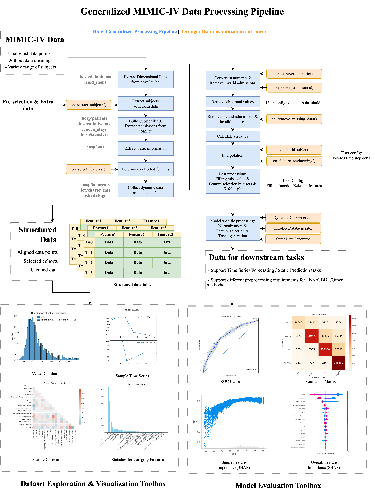

# MIMIC-IV Data Processing Pipeline

**[中文版本](README_CN.md) | [English Version](README.md)**

MIMIC-IV数据集广泛地用于各种医学研究，然而原始数据集并没有经过数据清洗。本框架提供了针对MIMIC-IV的一个高度可配置的Pipeline，以最小化封装、高灵活度、易拓展性为目标。数据处理的代码耦合度低，可以方便地与其他数据集的处理代码合并。框架本身提供了一个默认的处理流程，同时，该框架提供在配置文件和调用接口两个层级的用户自定义配置，可以满足复杂的用户自定义需求。

## 架构

该框架主要包括三个部分：数据集dataset、模型model、分析器analyzer。dataset将原数据抽象为torch.dataset接口；model对批次输入计算输出；analyzer类似trainer，提供K-fold、指标计算、绘图等工作。将model和analyzer拆分，使得一个analyzer调用多个model进行集成学习、一个model被多个analzyer调用等情况更加方便。其余的tools部分包括共用的工具方法，configs部分为需要配置的字段，例如路径、数据清洗的参数等。

analyzer: 分析模块
1. analyzer: 按照序列运行anlayzer，添加新analyzer时需要注册
2. analyzer_utils: 工具类
3. container: 存放与模型无关的参数
4. 其他文件: 每个文件代表一个独立的analyzer, 执行特定的下游任务

configs: 每个数据集对应的配置文件
1. global_config: 配置路径
2. mimiciv_dataset_XXX: 对应`dataset/derived_XXX_dataset.py`，是我们对不同pipeline的示例实现。默认提供三个实现，ards/vent/raw
   1. ards：进行ARDS时序预测的四分类任务
   2. vent：进行ventilation时序预测的二分类任务
   3. raw：用于数据集可视化

其他模块:
- data: 数据集文件
- datasets: 数据集抽象, 包括数据提取/清洗/重新组织
- models: 模型
- outputs: 输出文件夹
- tools: 工具类
- main.py: **主入口**
- launch_list.yml 配置程序启动后运行哪些analyzer

## 部署方法

按照以下步骤部署：
1. 在`python=3.10.11`环境下配置conda环境，并安装所需的packages：`pip install -r requirements.txt`
2. 第一步中关于pytorch的cuda版本问题参考下一小节
3. 将MIMIC-IV数据集解压至`data/mimic-iv`文件夹下, 子文件夹有`hosp`,`icu`等
4. （可选）如果有MIMIC-IV-ED文件，解压至`ed`子文件夹
5. 将生成的`sepsis3.csv`存放在`data/mimic-iv/sepsis_result`下，ventilation类似（需要MIMIC-Code的结果才能生成标签）
6. 运行`python -u main.py`，一次生成

安装Pytorch对应的CUDA版本：
1. 新建并进入一个conda虚拟环境
2. 输入`nvidia-smi` 查看服务器安装的CUDA版本
3. 按照 https://pytorch.org/get-started/previous-versions/ 选择linux下的对应版本的安装命令，pytorch对应的CUDA版本可以落后于服务器的CUDA版本
4. 检查是否安装成功： https://blog.csdn.net/qq_45032341/article/details/105196680
5. 如果安装了不同于`requirements.txt`中的pytorch版本，将对应的行删掉，避免重复安装
6. 这个框架本身对第三方库的版本没有严格限制

## MIMIC-IV数据集

我们将对数据集的处理分为两个部分：`dataset specific processing`和`model & task specific processing`，前者主要处理数据集的内部结构产生的问题，后者对不同的下游任务会进行不同的处理。`datasets/mimiciv/MIMICIV`中的代码用于`dataset specific processing`，在一般情况下用户不需要修改其中的内容。

`model & task specific processing`由派生类和`data_generator`共同完成。`datasets/mimic_dataset/MIMICIVDataset`是`MIMICIV`的派生类，通过重写以`on_`开头的抽象方法来实现对不同下游任务的灵活处理，用户需要对这部代码进行修改，用于满足不同的研究需求。`MIMICIV`的每个派生类都在`config`中拥有独立的配置文件，通过修改配置文件，可以在不修改代码的情况下调整`MIMICIV`的行为。

### 一些重要概念

`static/dynamic features`: 实际上我们不区分静态和动态特征，静态特征也可以有采样时刻。它们的区别主要是，前者可以不属于任何一个admission，按照时间被分配到某个admission中，而且时间轴不会减去起始时间。后者一定属于某个admission，在采集的时候就确定好了。

`derived_XXX_dataset/dataset_version`：一个下游任务从`MIMIC_Core`中派生得到derived_XXX_dataset，derived_XXX_dataset可以有多个datset_version

### MIMICIV处理流程介绍

这部分处理对应`dataset specific processing`，在大多数情况下用户不需要修改其中的内容，只需理解大致的处理流程和接口的定义。按照最小封装原则，仅用`@property`区分内部和外部可见属性，用`@abstractmethod`指示哪些方法需要被派生类重写。

**数据存取**：`MIMICIV`的数据处理分为7个阶段（phase），每个阶段处理后的数据会存入cache，在`data/mimic-iv-XXX/cache`下（例如, 如果是`mimic_raw`，则存储在`data/mimic-iv-raw/cache`下），一旦所有数据处理完毕，每次实例化时仅载入最终结果对应的cache，去除不必要的IO操作，此时会显示`Bare Mode Enabled`。另外，为了节约空间，cache采用lzma算法压缩，压缩耗时会大于pickle直接存储的耗时，但是对读取几乎没有影响，如果需要省去压缩的时间，修改`configs/mimic_dataset/compress_cache`为`False`

**preprocess_phase1**：载入`hosp`, `icu`的item映射表，为`ed`创造对应的映射表，不需要实际读取ED的数据。之后调用`on_extract_subjects`引入需要筛选subject列表和外部数据。

**preprocess_phase2**: 按照subject_id列表读取患者的基本信息，这一阶段先后调用`on_build_subject`, `on_extract_admission`

**preprocess_phase3**: 从MIMIC-IV中遍历所有的可用数据，并抽取需要的数据。有三个数据源（`icu`, `ed`, `hosp`）通过`configs/mimic_dataset/data_linkage`可以配置哪些数据源不需要读取。在数据抽取之前，通过`on_select_feature`简单地排除哪些特征是不需要的

**preprocess_phase4**: 将数据转化为数值型，筛选可用的样本，最后将异常值按照`configs/mimic_dataset/value_clip`约束在正常范围内。在前两个过程中，将依次调用`on_convert_numeric`, `on_select_admissions`

**preprocess_phase5**: 进一步去除高缺失率的特征和样本，生成每个特征的统计数据，这些统计数据在时间轴对齐之前生成，因此不受插值和缺失填充的影响。这一步将调用`on_remove_missing_data`

**preprocess_phase6**: 对不均匀采样的数据进行插值和对齐，按照一定的时间间隔生成一个三维数组`(n_subject, n_feature, n_sequence)`，不同长度的序列用`-1`填充末尾，最后进行特征工程。该阶段依次调用`on_build_table`, `on_feature_engineering`

插值考虑三种情况：
1. 一个admission的头和尾通过`configs/mimic_dataset/align_target`确定，寻找target features都存在的最早和最晚时间点。插值的时间间隔由`configs/mimic_dataset/delta_t_hour`确定。
2. 当某个时间点存在历史数据时，选用最近的历史可用数据，不受因果性影响
3. 当插值起始时间早于该特征已知的历史数据时，用第一个数据点填充空缺的部分。

**preprocess_phase7**: 按照`configs/mimic_dataset/version`生成同一个数据集的不同衍生版本，用户可以在配置中自定义特征的限制范围和排除范围，指定缺失值的处理方法，目前支持`avg`均值填充和`none`缺省（-1）填充。不同版本可以分别用于数据探查和模型训练。这一阶段也会设置固定的K-fold，保持训练的稳定性

### MIMICIV derived dataset介绍

这部分对应`datasets/mimic_dataset`中的函数，建议用户只修改必要的部分，并且明确接口的输入输出格式。这个框架对于用户自定义行为几乎没有检查，如果用户修改的部分引入新的问题（例如产生NaN），可能会使得Pipeline的其他部分报错。

**on_extract_subjects**

输出: dict[key=int(subject_id), value=object(extra_data)]
1. subject_id需要覆盖所有采集的患者，可以和其他数据pipeline链接，比如通过读取`mimic-code`的衍生表得到
2. `extra_data`包含subject对应的附加数据，格式不受限制，仅在`on_build_subject`中被用户处理

**on_build_subject**

创建Subject实例

输入：
1. subject_id: int
2. subject: Subject类型，通过`append_static`方法添加新数据
3. row: `hosp/patients.csv`中对应subject的行数据，包括`gender`, `dod`等
4. _extract_result: 在`on_extract_subjects`中提取的数据

输出: subject，这是一个reference，实质上添加内容是通过`append_static`方法

**on_extract_admission**

向subjects中添加Admission实例

输入：
1. subject: Subject
2. source: str, 取值可以是(`admission`, `icu`, `transfer`) 分别提取自 `hosp/admission.csv`, `icu/icu_stays.csv`, `hosp/transfers.csv`
3. row: namedtuple,  从`source`对应的表中提取的行

输出：bool，是否添加了admission，用于统计

通过`Subject.append_static()`和`Admission.append_dyanmic()`添加数据

**on_select_feature**

输入：
1. id: int, subject_id
2. source: str, 取值可以是(`icu`, `hosp`, `ed`)， 源文件分别来自于`icu/d_items.csv`, `hosp/d_labitems.csv`, `ed`具有内置的格式
3. row: dict, key的含义参考`source`对应源文件中各列的含义
   - source=`icu`, key=[`id`, `label`, `category`, `type`, `low`, `high`]
   - source=`hosp`, key=[`id`, `label`, `fluid`, `category`]
   - source=`ed`, key=[`id`, `link_id`, `label`]   其中`link_id`将ED的基本生命体征链接到ICU到生命体征中，不作为单独一列

输出：bool, False表示不选择该特征，True表示选择。注意这一阶段只需去除不需要的特征，选择的特征还会被进一步筛选

**on_convert_numeric**

不建议重写该方法，应当仿造示例仅重写判断语句中的内容

`Subject.static_data`: dict[key=str, value=list[tuple(value, time)]]，修改非数值型特征的值使得所有特征都变为数值型

**on_select_admissions(remove_invalid_pass1)**

按照条件筛选可用的样本，不建议重写整个方法，应该按照任务需要修改筛选条件

输入:
1. rule: dict, 来源是`configs/mimiciv_dataset/remove_rule/pass1`
2. subjects: dict[subject_id: int, Subject]

默认的筛选条件用于筛选Sepsis患者，需要全部满足:
1. 是否包含`target_id`中的全部特征，如果不包含，在某些任务中无法生成时序标签
2. 时长是否满足条件，太短的序列无法用于预测，太长的序列会影响padding后表的大小
3. 关于`Sepsis time`的筛选条件，在非Sepsis任务中不需要

**on_remove_missing_data(remove_invalid_pass2)**

进一步筛选可用的样本和特征，除非必要，建议只修改配置文件中的missrate，不修改代码

默认的算法进行多步迭代，同时删除高缺失的特征和样本，迭代步骤由配置文件中的`max_col_missrate`和`max_subject_missrate`的列表长度决定，列表末尾的missrate是最终的missrate

`adm_select_strategy`有两种选择，`random`表示在每个subject的可用admission中随机选择一个，`default`表示默认选择第一个有效的admission

**on_build_table**

在确定序列开始时间时，修改某些特征的取值，这些特征往往和时间有关

输入:
1. subject: Subject
2. key: str, 当前修改的特征id
3. value: float：原值
4. t_start: float，表示当前序列的起始时间距离admit time的时间，是正数

输出：new_value: float, 当前特征的新值

**on_feature_engineering**

在插值后，根据已有特征计算新的特征。不建议重写整个方法，可以修改判断语句中的一部分。注意原始特征需要考虑缺失(-1)的情况，如果原始特征缺失，新特征也应当设置为-1

输入：
1. tables: list[np.ndarray[n_features, n_sequences]], 制表后的数据，没有padding
2. norm_dict: dict[key='mean' or 'std', value=float], 存储特征的统计数据，新特征需要更新它
3. static_keys, dynamic_keys: list[str]，新特征需要更新它们

输出：更新后的tables, norm_dict, static_keys, dynamic_keys

## Data generator介绍

`model & task specific processing`不总是能被pipeline解决，例如，不同模型需要不同的归一化方法、时序和非时序任务需要不同的数据组织格式。我们提供了多种generator生成不同的数据格式和标签

总的来说，有3种DataGenerator和两种LabelGenerator，它们在`models/utils`下，用户可以很方便地开发新的Generator。我们提供了几种示例算法，说明不同的generator是如何用于不同任务的。

### label generator

**LabelGenerator_4cls**：将任意大小的target数组拓展一个新的维度，按照事先设定的大小划分为四个类别，用于分类预测

**LabelGenerator_regression**: 不进行任何处理，可以修改用于其他任务

### data generator

不同的data generator和label generator可以任意组合，参考示例算法: `analyzer/method_nearest_cls`

**DynamicDataGenerator**: 对每个数据点，向前搜索一个预测窗口，并计算窗口内的最低值作为预测目标。它也会采集可用的特征，和`dataset version`类似，并且可以进行归一化。最终结果依然是一个三维结构，时间轴不会被展开。可以用于LSTM等RNN算法。

**SliceDataGenerator**：按照`DynamicDataGenerator`的方式计算，但是最终数据的时间轴会被展开，成为(n_sequence, n_feature)的形式，无效数据会被剔除。用于GBDT等非时序方法

**StaticDataGenerator**：对每个序列，生成一个大预测窗口，用第一时刻的特征预测终局情况。每个序列生成一个样本。

## 更多帮助

[如何生成Sepsis3.csv](documents/processing.md)

